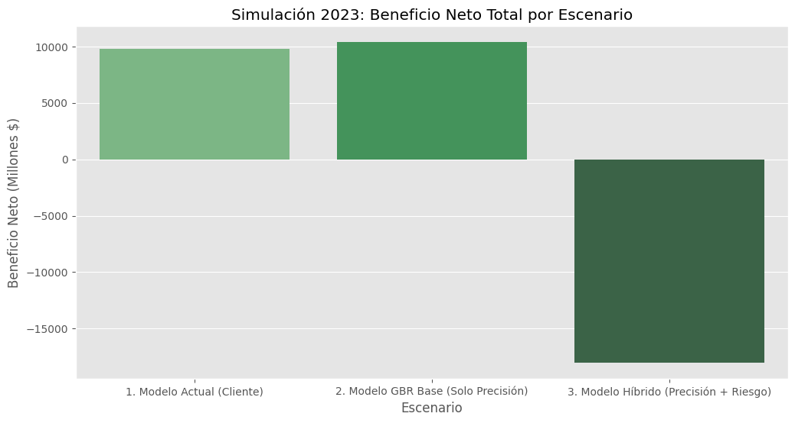
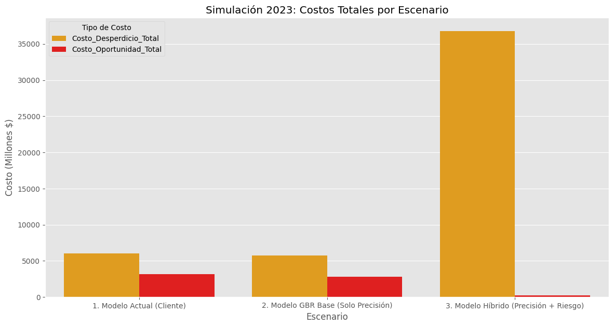

# **Demand Forecasting for Agricultural Products**
*A Senior-Level Analysis in Model Validation & Economic Backtesting*
--
## 1. Project Summary
This project documents the development of a Data Science solution for an agricultural products distributor facing critical inventory problems. While the initial goal was to build a complex hybrid model, the project's key finding came from a rigorous economic backtest that invalidated this hypothesis.

The analysis, performed on 2023 data, revealed two crucial insights:

1. The complex "Hybrid Model" (GBR + Risk) was a financial disaster, generating $-7.44 Billion in net losses due to extreme data outliers creating massive waste costs.

2. The "GBR Base Model" (high-precision forecast) was the clear winner, outperforming the client's current model_actual by $610 Million in net benefit.

This project evolved from a forecasting challenge into a senior-level case study on how to use economic backtesting to validate a hypothesis, pivot, and select the optimal, high-value solution.

## 2. The Business Problem
The client was facing two primary, costly challenges:

1. **Excess Inventory**: The previous model (model_actual) often overestimated demand, leading to high storage costs and spoilage of perishable goods.

2. **Lost Sales**: The same model underestimated demand for volatile products, resulting in stockouts and lost revenue.

## 3. Key Findings: Economic Backtest
Instead of relying on technical metrics like WAPE alone, we simulated the financial performance of three models on 2023 data. This economic backtest became the core of the project.

The conclusion is undeniable: The "GBR Base" model finds the financial sweet spot, reducing both waste and lost sales relative to the client's model. The "Hybrid" model's attempt to cover 100% of risk created catastrophic waste.

| Scenario |	Net Benefit (Total) |	Cost of Waste (Spoilage) |	Cost of Lost Sales |
| 1. Model Actual (Client) |	$9.78B	| $6.01B |	$3.15B |
| 2. GBR Base (Our Solution) |	**$10.39B** |	$5.75B |	$2.81B |
| 3. Hybrid Model (Investigation) |	$-7.44B	| $26.32B |	$0.06B |

The GBR Base model provides a $610 Million uplift in Net Benefit over the client's current system, proving its superiority.

## 4. Evidence & Solution Visualization

**The Economic Proof**
backtest_beneficio_net.png and backtest_costos_totales.png, illustrate why the complex hybrid model was rejected and the GBR Base model was chosen.

Net Benefit (Higher is Better)


Total Costs (Lower is Better)


**The Final Solution: GBR Forecast**
The final recommended solution is to replace the model_actual with our GBR forecast. This graph shows the historical data (blue) followed by our winning GBR forecast (green).

# 5. Repository Structure 

The project is modularized into a 4-notebook pipeline:

```bash 
project-repository/
├── data/
│   ├── raw/
│   │   └── demanding_forecast.csv     (Original raw data)
│   ├── interim/
│   │   └── model_core_validation.csv  (Output of N-01 -> Input for N-02)
│   └── processed/
│       ├── predicciones_demanda_2024.csv    (Output of N-03, The winning forecast)
│       └── politica_inventario_final_2024.csv (FINAL DELIVERABLE)
├── models/
│   └── gbr_model.joblib               (Trained GBR model, Output of N-01)
├── notebooks/
│   ├── 01-model_core.ipynb            (GBR Training & Validation, the "Winner")
│   ├── 02-model_risk_gpd.ipynb        (Investigation & Economic Backtesting)
│   ├── 03-model_inference.ipynb       (Re-training & Inference of the Winning Model)
│   └── 04-generar_reporte_final.ipynb (Final Report Assembly & Visualization)
├── reports/
│   └── figures/
│       ├── backtest_beneficio_neto.png
│       ├── backtest_costos_totales.png
│       └── trazabilidad_final_gbr.png
├── requirements.txt                   (Project dependencies)
└── README.md                          (This file)
```

**Notebook Descriptions**:
1. 01-model_core.ipynb:
    - Trains the GradientBoostingRegressor (GBR) on data up to 2022.
    - Validates the model against 2023 data and compares it to the modelo_actual (achieving a 6.31% WAPE improvement).
    - Saves the validated model (gbr_model.joblib) and the validation results (model_core_validation.csv).

2. 02-model_risk_gpd.ipynb:
    - The most critical notebook. Loads the validation data.

    - Investigates multiple risk models (GPD, Heuristics) to create a "Hybrid Model."

    - Runs the Economic Backtest (the 3-way comparison) which proves the Hybrid Model is financially unviable and the GBR Base Model is the winner.

    - Generates the key "Evidence" charts.

3. 03-model_inference.ipynb:
    - Loads the hyperparameters of the winning GBR model.

    - Re-trains the GBR model on the full historical dataset (2012-2023).

    - Generates the final 2024 forecast (predicciones_demanda_2024.csv).

4. 04-generar_reporte_final.ipynb:

    - Loads the winning 2024 forecast.

    - Creates the final, simplified inventory policy.

    - Generates the "Solution" traceability chart.

## 6. How to Run the Project
1. Clone the repository.

2. Create a virtual environment:
```bash
python -m venv venv
source venv/bin/activate  # macOS/Linux
.\venv\Scripts\activate   # Windows
```

3. Install the dependencies:
```bash
pip install -r requirements.txt
```

4. Run the Jupyter notebooks in order (from 01 to 04).

--- 
## 7. Detailed Analysis
---
### **Model Construction & Validation**
The final solution is the **GBR Core Model**.

- Model: A GradientBoostingRegressor was chosen for its high performance in handling seasonality and complex interactions across 1,000 time series.

- Precision (WAPE): We used WAPE (Weighted Absolute Percentage Error) as the primary technical metric. On 2023 data, our GBR model was 6.31% more accurate than the client's model_actual.

- Forecast Window (12 Months): A 12-month window (all of 2024) was selected to allow for strategic planning around the strong annual seasonality of agricultural products.

**Measuring Economic Benefit ($) - The Core Finding**

As shown in Section 3, the key validation was an Economic Backtest. This simulation proved that the complex risk model (GPD) was a failure, as the data's extreme outliers meant the cost to cover all risk ($26.32B in waste) was far greater than the risk itself ($3.15B in lost sales).

The backtest proved that simply replacing the model_actual with our more precise GBR Base Model was the optimal path, unlocking $610M in net benefit by finding a better balance between waste and lost sales.


### **Production Methodology (MLOps)**
We propose the following deployment and monitoring (MLOps) framework:

#### **Phase 1: Shadow Mode Deployment**

- Action: For the first month, the GBR pipeline runs in parallel with the model_actual. Its results are logged but not used for purchasing.

- Purpose: To validate that the live model's performance (WAPE) matches the backtest results without operational risk.

#### **Phase 2: Canary Deployment**

- Action: In month two, the GBR model's recommendations are used for a limited group of products (e.g., 10% of SKUs).

- Purpose: To verify the real-world impact on inventory levels and costs.

#### **Phase 3: Continuous Monitoring & Maintenance**:

- Performance Monitoring (Model Drift): WAPE is tracked monthly. If the error rate climbs, an alert is triggered for review.

- Data Monitoring (Data Drift): Alerts are set to detect if input data (like precio_promedio) changes suddenly.

- Retraining Plan: The Core Model (GBR) is automatically retrained monthly with the latest sales data (as built in notebook 03) to keep the forecast relevant.
