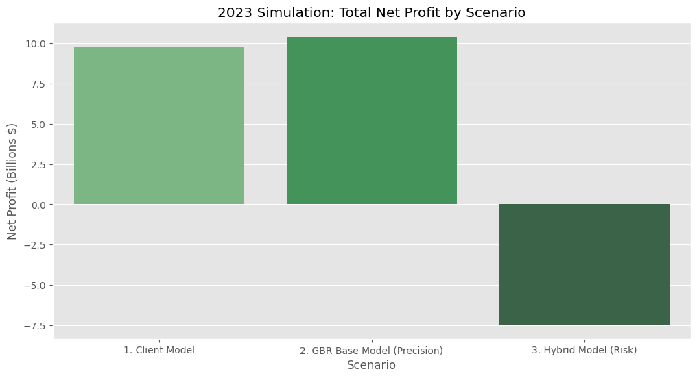
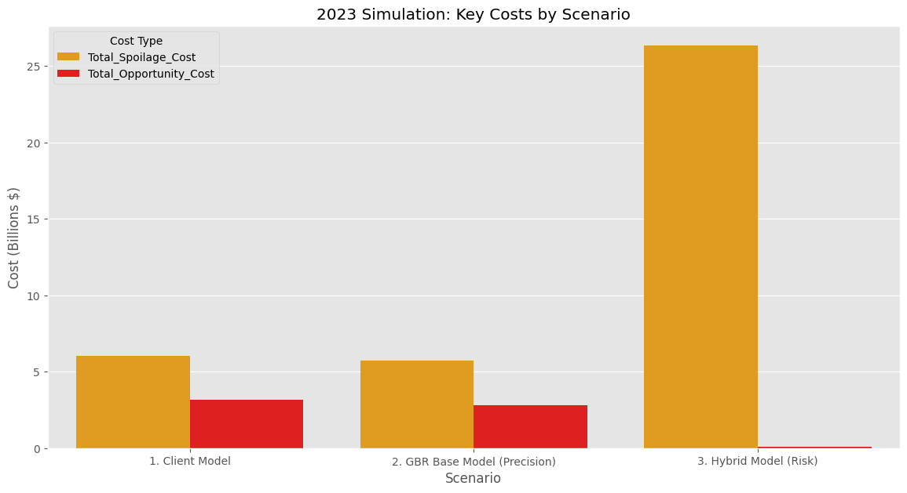
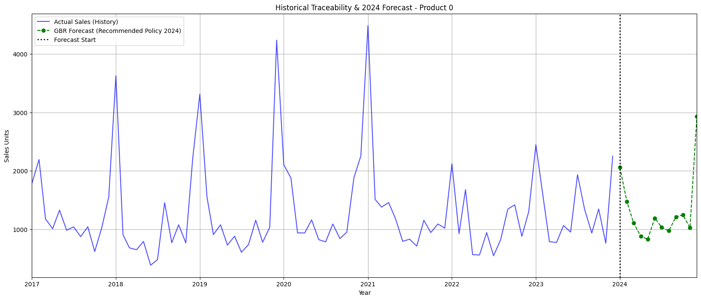

# **Demand Forecasting MLOps Pipeline**
*A Senior-Level Analysis in Model Validation, Economic Backtesting, and Production Orchestration (Docker + Airflow)*
--

## 1. Project Summary
This project documents the development of a Data Science solution for an agricultural products distributor facing critical inventory problems. While the initial goal was to build a complex hybrid model (GBR + GPD), the project's key finding came from a **rigorous economic backtest** that invalidated this hypothesis.

The analysis, performed on 2023 data, revealed two crucial insights:

1.  The complex "Hybrid Model" (GBR + Risk) was a financial disaster, generating **$-7.44 Billion** in net losses due to extreme data outliers creating massive waste costs.
2.  The "GBR Base Model" (a high-precision forecast) was the clear winner, outperforming the client's current `model_actual` by **$610 Million** in net benefit.

This project evolved from a forecasting challenge into a senior-level case study on how to use economic backtesting to validate a hypothesis, pivot, and then **package and deploy** the optimal solution into a production-ready MLOps pipeline using **Docker** and **Apache Airflow**.

## 2. The Business Problem
The client was facing two primary, costly challenges:

1.  **Excess Inventory**: The previous model (`model_actual`) often overestimated demand, leading to high storage costs and spoilage of perishable goods.
2.  **Lost Sales**: The same model underestimated demand for volatile products, resulting in stockouts and lost revenue.

## 3. Key Findings: The Economic Backtest
Instead of relying on technical metrics (like WAPE) alone, we simulated the financial performance of three models on 2023 data. This economic backtest became the core of the project.

The conclusion is undeniable: The "GBR Base" model finds the financial sweet spot, reducing both waste and lost sales relative to the client's model. The "Hybrid" model's attempt to cover 100% of risk created catastrophic waste.

| Scenario | Net Benefit (Total) | Cost of Waste (Spoilage) | Cost of Lost Sales |
| :--- | :---: | :---: | :---: |
| **1. Model Actual (Client)** | \$9.78B | \$6.01B | \$3.15B |
| **2. GBR Base (Our Solution)** | **\$10.39B** | **\$5.75B** | **\$2.81B** |
| **3. Hybrid Model (Investigation)** | `$-7.44B` | `$26.32B` | `$0.06B` |

The GBR Base model provides a **$610 Million uplift in Net Benefit** over the client's current system, proving its superiority.

## 4. Evidence & Solution Visualization

### The Economic Proof (The "Why")
These charts, generated by our validation pipeline, illustrate *why* the complex hybrid model was rejected and the GBR Base model was chosen.

**Net Benefit (Higher is Better)**


**Total Costs (Lower is Better)**


### The Final Solution (The "What")
The final recommended solution is to replace the `model_actual` with our GBR forecast. This graph (generated by our final Airflow task) shows the historical data (blue) followed by our winning GBR forecast (green).



## 5. MLOps: Production Pipeline with Docker & Airflow
This project is not just a collection of notebooks; it is a complete, containerized MLOps pipeline ready for production.

* **Docker:** The entire environment (Airflow, Python, all dependencies) is containerized using `docker-compose.yaml`. This solves all OS-level incompatibilities (like the `fcntl` error on Windows) and ensures 100% reproducibility, fulfilling the job requirement.
* **Airflow:** The pipeline is orchestrated by the DAG defined in `dags/dag_demand_forecast.py`.
* **Refactoring:** All notebook logic was refactored into robust, testable Python functions in `src/pipeline_tasks.py`.
* **Automation:** The DAG is scheduled to run automatically on the 1st of every month. It runs two main tasks:
    1.  `run_validation_and_backtest`: Re-trains/validates the model and runs the economic backtest to monitor financial performance.
    2.  `run_final_inference`: Re-trains the model on 100% of the data and generates the final prediction files for the business.

## 6. Repository Structure

The project is modularized to tell the story of the analysis, from research to production.

```bash
project-repository/
├── data/
│   ├── raw/
│   ├── interim/
│   └── processed/
├── dags/
│   └── dag_demand_forecast.py     # Airflow DAG: The "instructions" for the pipeline
├── models/
│   └── gbr_model.joblib           # The validated GBR model artifact
├── notebooks/                     # --- RESEARCH & DISCOVERY ---
│   ├── 01-model_core.ipynb        # 1. Building the GBR Base Model 
│   ├── 02-risk_investigation.ipynb # 2. The Economic Backtest 
│   ├── 03-model_inference.ipynb   # 3. Building the inference logic
│   └── 04-generate_final_report.ipynb # 4. Assembling final reports
├── reports/
│   └── figures/
│       ├── backtest_profit_net.png
│       ├── backtest_total_costs.png
│       └── final_traceability_gbr.png
├── src/
│   └── pipeline_tasks.py          # Production Python script refactored from notebooks
├── docker-compose.yaml            # --- PRODUCTION PIPELINE (MLOps) ---
├── requirements.txt               # Python dependencies for the pipeline
└── README.md                      # (This file)
```

**Notebook Descriptions**:
1. 01-model_core.ipynb:
    - Trains the GradientBoostingRegressor (GBR) on data up to 2022.
    - Validates the model against 2023 data and compares it to the modelo_actual (achieving a 6.31% WAPE improvement).
    - Saves the validated model (gbr_model.joblib) and the validation results (model_core_validation.csv).

2. 02-model_risk_gpd.ipynb:
    - The most critical notebook. Loads the validation data.
    - Investigates the "Hybrid Model" hypothesis (using GPD and robust heuristics).
    - Runs the Economic Backtest (the 3-way comparison) which proves the Hybrid Model is financially unviable and the GBR Base Model is the winner.
    - Generates the key "Evidence" charts.

3. 03-model_inference.ipynb:
    - Loads the hyperparameters of the winning GBR model.
    - Re-trains the GBR model on the full historical dataset (2012-2023).
    - Generates the final 2024 forecast (demand_forecasts_2024.csv).

4. 04-generate_final_report.ipynb:
    - Loads the winning 2024 forecast.
    - Creates the final, simplified inventory policy.
    - Generates the "Solution" traceability chart.

## 7. How to Run the Project
You can run this project in two ways:
### A. To Run the Production MLOps Pipeline (Recommended)
This method demonstrates the full, containerized Airflow pipeline.

1. Ensure Docker Desktop is installed and running.

2. From the project root, build and run the containers in detached mode:
```bash
docker-compose up -d
```
3. Wait 3-5 minutes for the containers to build and for pip install to complete.
4. Open the Airflow UI in your browser: http://localhost:8080
5. Log in with credentials.
6. Find the demand_forecast_pipeline DAG, un-pause it (toggle switch), and trigger a manual run using the "Play" (▶️) button.
7. Click the DAG name to watch the "Grid" view as the tasks (run_validation_and_backtest and run_final_inference) execute and turn green.
8. Check the data/processed and reports/figures folders to see the newly generated files.
9. When finished, shut down all containers:
```bash
docker-compose down
```

### B. To Explore the Original Research (Notebooks)
This method is for exploring the step-by-step logic in a local environment.
1. Clone the repository.

2. Create and activate your local virtual environment:
```bash
python -m venv demand_forecasting
source demand_forecasting/bin/activate  # macOS/Linux
.\demand_forecasting\Scripts\activate   # Windows
```

3. Install the dependencies:
```bash
pip install -r requirements.txt
```

4. Launch Jupyter Lab:
```bash
jupyter lab
```

5. Open the notebooks/ folder and run the notebooks in order (01 to 04).

--- 
## 8. Detailed Analysis
---
### **Model Construction & Validation**
The final solution is the GBR Core Model, as its validation proved it to be the most financially sound.
- **Model**: A GradientBoostingRegressor was chosen for its high performance in handling seasonality and complex interactions across 1,000+ time series.
- **Precision (WAPE)**: We used WAPE (Weighted Absolute Percentage Error) as the primary technical metric. On 2023 data, our GBR model was 6.31% more accurate than the client's model_actual.
- **Forecast Window (12 Months)**: A 12-month window (all of 2024) was selected to allow for strategic planning around the strong annual seasonality of agricultural products.
- **Economic Benefit ($) - The Core Finding:** As shown in Section 3, the key validation was an Economic Backtest. This simulation proved that the complex risk model (GPD/Heuristics) was a failure, as the data's extreme outliers meant the cost to cover all risk ($26.32B in waste) was far greater than the risk itself ( $3.15Bin lost sales). The backtest proved that simply replacing themodel\_actual\ with our more precise GBR Base Model was the optimal path, unlocking $610M in net benefit.

### **Production Methodology (MLOps)**
The research pipeline (notebooks) was refactored into a production-ready system. This system is defined by the docker-compose.yaml, the src/pipeline_tasks.py script, and the dags/dag_demand_forecast.py orchestrator.

This is the proposed deployment and monitoring framework for this new pipeline:

#### **Phase 1: Shadow Mode Deployment**
- **Action**: The Airflow DAG (demand_forecast_pipeline) is enabled in production, running on its schedule (1st of the month). Its final output (final_inventory_policy_2024.csv) is logged, but not used by the business for purchasing.
- **Purpose**: To run in parallel with the client's model_actual for 1-2 months. This validates that the automated pipeline's performance (WAPE, financial metrics) matches our backtest results without any operational risk.

#### **Phase 2: Canary Deployment**
- **Action**: In month 3, the pipeline's output is used to make real purchasing decisions, but only for a limited, controlled group of products (e.g., 10% of SKUs).
- **Purpose**: To verify the real-world impact on inventory levels, spoilage, and stockouts in a contained environment before a full rollout.

#### **Phase 3: Full Deployment & Continuous Monitoring**:
- **Action**: The pipeline is now the system of record for 100% of products.
- **Performance Monitoring (Model Drift)**: The run_validation_and_backtest task in our Airflow DAG automatically acts as our monitor. By logging its financial results (Beneficio Neto) each month, we can build a dashboard (e.g., in Streamlit or PowerBI) to track model performance. If the Net Benefit begins to trend down, that is Model Drift, and a Data Scientist is alerted to review.
- **Data Monitoring (Data Drift)**: A new task would be added to the Airflow DAG to run before the validation task. This task would use a library (like Evidently AI or Pandas Profiling) to check if the new raw_data inputs have changed (e.g., precio_promedio is suddenly null, or a new prod_id appears) and alert the team.
- **Retraining Plan**: The Core Model (GBR) is automatically retrained monthly with the latest sales data. This is already built into the run_final_inference task in our pipeline, keeping the forecast relevant.
